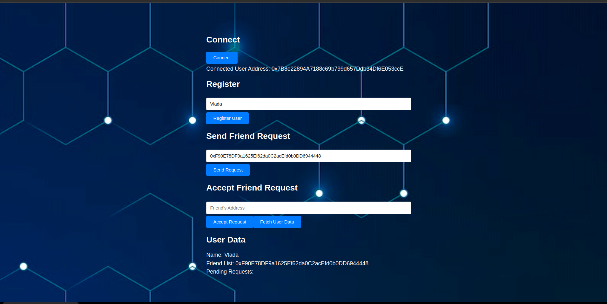

# FriendshipPlatform
Razvijanje decentralizovane platforme gde korisnici mogu da traže prijatelje i da prihvate zahteve za prijateljstvo od drugih korisnika.

Ključne komponente koje treba uzeti u obzir prilikom izrade DApp-a su:

• FriendshipPlatform.sol sa deployment-om na testnu mrežu: Ovo će biti Solidity
pametni ugovor koji će upravljati procesom slanja i prihvatanja zahteva za
prijateljstvo 

• Web3 integracija: Front-end vaše aplikacije mora da interaguje sa pametnim
ugovorom. Korišćenje JavaScript biblioteke kao što su Web3.js ili ethers.js se
preporučuje. Preporučuje se setup odrađen na vežbama. Treba da instalirate Node
JS, React JS i pokrenete React JS. Komande se na Windows-u mogu pozivati iz
PowerShell-a (za Linux i Mac se podrazumeva korišćenje standardnih Terminal
konzola) 

• Testiranje: Studenti treba da istraže kako se koristi i napišu testove za svoje
ugovore koristeći Truffle ili Hardhat 

Prilikom izrade korisceni su:

• Solidity za smart contract

• React za front end

• Ethers JS za spajanje front end-a i sol fajla

• Truffle za testiranje

